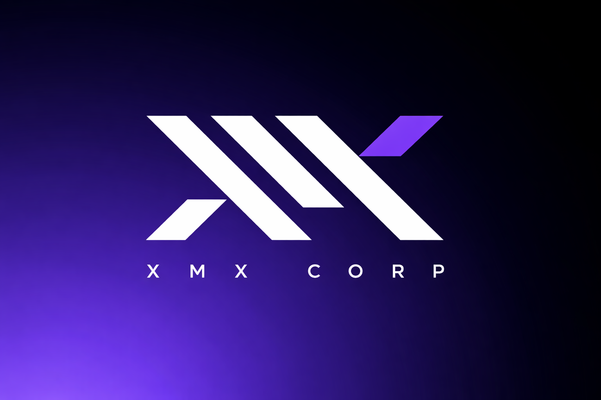
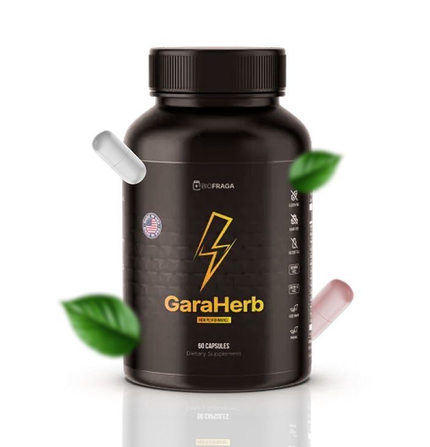

# GaRAHERB - Desafio XMX

<p align="center">
  
</p>


Este projeto é a minha resposta ao desafio proposto pela XMX, que consistiu na criação da landing page de um produto fictício chamado **GaRAHERB**.

<p align="center">
  
</p>

## 🎯 Objetivo

O principal objetivo deste desafio foi demonstrar e testar minhas habilidades e conhecimentos em desenvolvimento front-end, aplicando as melhores práticas para a criação de uma interface de usuário atraente e responsiva.

## 📁 Estrutura de Pastas

```
c:\Users\Georges Ballister\Desktop\Projeto\Desafio-XMX-Guaraherb\
├───index.html
├───style.css
├───.git\
└───assets\
    ├───01-Home\
    ├───02-Options\
    ├───03-AboutFormula\
    ├───04-Ingredients\
    ├───05-Benefits\
    ├───06-Comments\
    ├───07-Options&FinalOrder\
    ├───08-FAC\
    └───09-Footer\
```

## 🚀 Tecnologias utilizadas

<div style="display: inline_block">
  
  
  
</div>

## 🌐 Site Online

Você pode visualizar o resultado do projeto em produção no seguinte link:

[Acesse o site aqui](https://seu-link-de-hospedagem.com)

## ✨ Agradecimentos

<table>
  <tbody>
<tr>
    <td><p align="left-center"><b>Georges Ballister</b></p></td>
    <td><a href="https://www.linkedin.com/in/georges-ballister-de-oliveira/" target="_blank"></a></td>
  </tr>
</tbody>
</table>

Gostaria de expressar minha gratidão à XMX pela oportunidade de participar deste desafio. Foi uma experiência extremamente gratificante e uma ótima maneira de aprimorar minhas habilidades.

---

Feito com carinho, aprendi muito mais do que esperava desenvolvendo este projeto. Qualquer dúvida, abre uma issue! 💬
